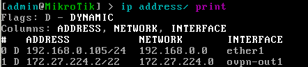

## Отчет по лабораторной работе №1 "Установка CHR и Ansible, настройка VPN"

University: [ITMO University](https://itmo.ru/ru/)

Faculty: [FICT](https://fict.itmo.ru)

Course: [Network programming](https://github.com/itmo-ict-faculty/network-programming)

Year: 2024/2025

Group: K34212

Author: Ivakhnyuk Valeriy Sergeevich

Lab: Lab1

Date of create: 25.09.2024

Date of finished: 26.09.2024

### Цель работы
Целью данной работы является развертывание виртуальной машины на базе платформы Microsoft Azure с установленной системой контроля конфигураций Ansible и установка CHR в VirtualBox

### Ход работы

1. Облачная виртуальная машина

Для хоста сервера VPN была выбрана виртуальная машина на ресурсах Google Cloud, с самыми минимальными характерстиками. 


Для установки python3 и ansible подключимся к машине по публичному адресу, нажав на кнопку ssh в списке рядом с ней.
Подключившись, выполняем команды

```
sudo apt install python3-pip
sudo pip3 install ansible-pylibssh
```

Для проверки установки выполняем команду 
```
ansible --version
```
Результат выполнения команды представлен на скриншоте.


Для установки OpenVPN сервера, выполним следующие команды:

```
apt update && apt -y install ca-certificates wget net-tools gnupg
wget https://as-repository.openvpn.net/as-repo-public.asc -qO /etc/apt/trusted.gpg.d/as-repository.asc
echo "deb [arch=amd64 signed-by=/etc/apt/trusted.gpg.d/as-repository.asc] http://as-repository.openvpn.net/as/debian jammy main">/etc/apt/sources.list.d/openvpn-as-repo.list
apt update && apt -y install openvpn-as
```

Результат их выполнения, а так же логин и пароль для входа представлены на скриншоте ниже


Перейдем к настройке OpenVPN сервера на облачной машине.
Введем данные представленные после установки в окно логина веб интерфейса админской панели


Окно админской панели представлено на скриншоте ниже


Отключаем TLS


Созздадим нового пользователя с правами автологина


Назначем адресу сервера внешний ip машины 


Создаем пользователю профиль с автологином


2. Настройка CHR машины

Перенесем полученный файл профиля на машину с помощью WinBox


Импортируем сертификат используя команду приведенную на скриншоте 


После этого, настраиваем PPP интерфейс, используя WinBox, выбрав OVPN client в меню создания интерфейса

В меню создания выставляем настройки, представленные на скриншоте ниже


3. Проверка

Для начала проверим со стороны CHR.
Воспользуемся командой 
```
interface ovpn-client monitor
```

В результате увидим, что мы подключились к VPN серверу, как представлено на скриншоте ниже


Так же, зайдем в логи сервера VPN, чтобы убедиться в подключении


Теперь проверим связь с помощью ping на внутренний ip облачной машины


Все успешно, теперь проверим пингом с облачной машины на CHR

Выведем ip нашего vpn клиента



И выполним ping с облачной машины


Все успешно

### Вывод: в ходе выполнения лабораторной работы был получен базовый опыт настройки VPN, используя OpenVPN сервер, и работы с облачным провайдером на примере GCP.