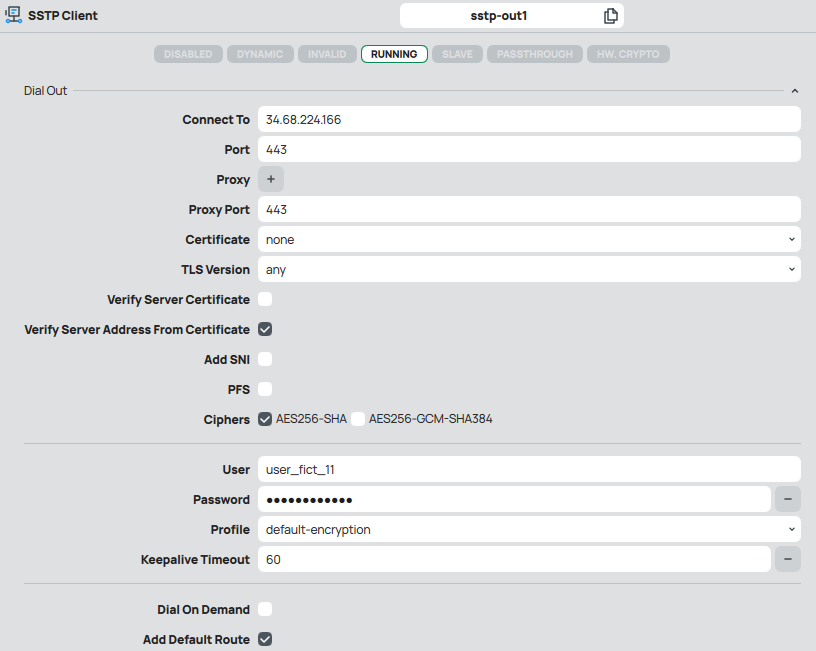
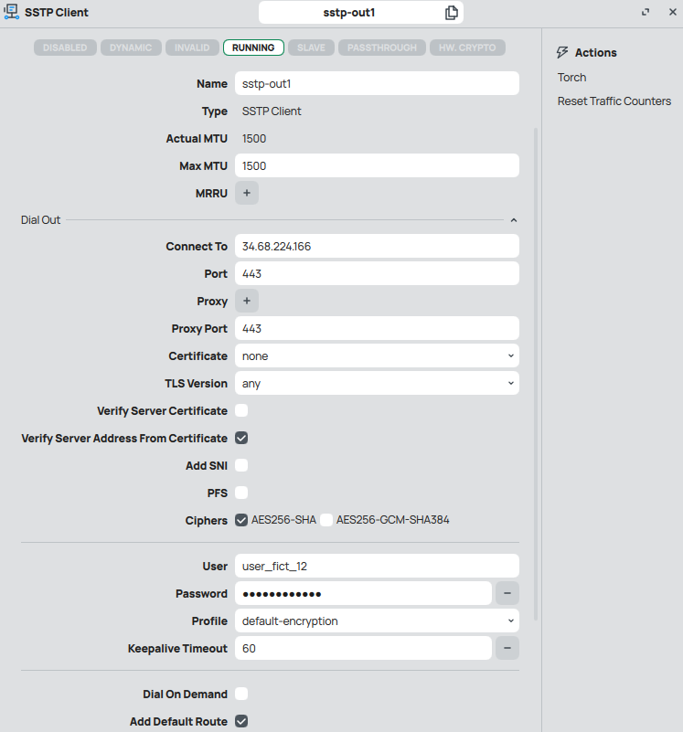
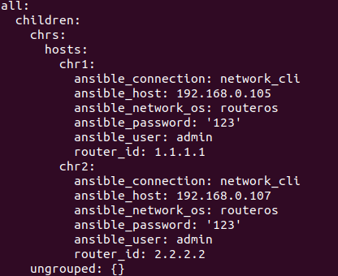
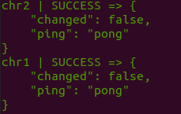
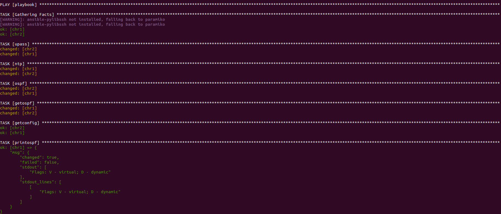
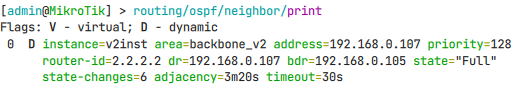
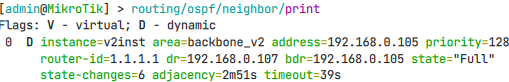
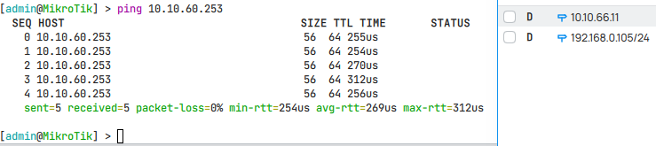
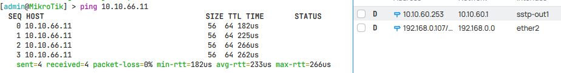

## Отчет по лабораторной работе №2 "Развертывание дополнительного CHR, первый сценарий Ansible"

University: [ITMO University](https://itmo.ru/ru/)

Faculty: [FICT](https://fict.itmo.ru)

Course: [Network programming](https://github.com/itmo-ict-faculty/network-programming)

Year: 2024/2025

Group: K34212

Author: Ivakhnyuk Valeriy Sergeevich

Lab: Lab2

Date of create: 14.10.2024

Date of finished: 25.10.2024

### Цель работы
Целью данной работы является настройка c помощью Ansible несколько сетевых устройств и собрать информацию о них, правильно собрать файл Inventory.

### Ход работы

В VirtualBox было произведено полное клонирование машины из первой ЛР для облегчения настройки, а так же был создан еще один пользователь sstp VPN сервера.

Настройки VPN-клиентов представлены на рисунках ниже.






создаем файл /etc/ansible/hosts и настраиваем хосты и общие переменные Ansible для них

```
[chrs]
CHR1 ansible_host=192.168.0.105 router_id=1.1.1.1
CHR2 ansible_host=192.168.0.107 router_id=2.2.2.2

[chrs:vars]
ansible_user=admin
ansible_password="123"
ansible_connection=network_cli
ansible_network_os=routeros
```

проверяем с помощью команды ansible-inventory


проверяем доступность наших CHR воспользовавшись ansible -m ping all



Далее создадим playbook по которому будет отрабатывать ansible

```yaml
- name: "playbook"
  hosts: chrs

  tasks:
    - name: upass
      community.routeros.command:
        commands: "user add name=user1 password=user1 group=full"

    - name: ntp
      community.routeros.command:
        commands: "system ntp client set enabled=yes servers=8.8.8.8"

    - name: ospf
      community.routeros.command:
        commands:
          - /interface bridge add name=Lo
          - /ip address add address="{{ router_id }}"/32 interface=Lo
          - /routing ospf instance add name=v2inst version=2 router-id="{{ router_id }}"
          - /routing ospf area add name=backbone_v2 area-id=0.0.0.0 instance=v2inst
          - /routing ospf interface-template add network=0.0.0.0/0 area=backbone_v2

    - name: getospf
      community.routeros.command:
        commands: "/routing ospf neighbor print"
      register: ospf_info

    - name: getconfig
      community.routeros.facts:
        gather_subset:
          - config
      register: config_info

    - name: printospf
      debug:
        msg: "{{ ospf_info }}"

    - name: printconfig
      debug:
        msg: "{{ config_info }}"
```

и запустим его.

Успешно получаем поэтапный вывод наших таск из плейбука



Теперь проверим фактическую успешность установки настроек непосредственно на chr машинах.

Вывод соседей из первого chr



Вывод соседей из второго chr



Теперь проверим их связность между собой с помощью пингов, которые ранее не проходили между ними

Пинг с CHR1 на CHR2


Пинг с CHR2 на CHR1


Все успешно!

### Вывод: в ходе выполнения лабораторной работы был получен опыт работы с Ansible, взаимодействием Ansible и Mikrotik между удаленными машинами, а так же с помощью Ansible были правильно настроены сетевые устройства.