## Отчет по лабораторной работе №3 "Развертывание Netbox, сеть связи как источник правды в системе технического учета Netbox"

University: [ITMO University](https://itmo.ru/ru/)

Faculty: [FICT](https://fict.itmo.ru)

Course: [Network programming](https://github.com/itmo-ict-faculty/network-programming)

Year: 2024/2025

Group: K34212

Author: Ivakhnyuk Valeriy Sergeevich

Lab: Lab1

Date of create: 31.10.2024

Date of finished: 08.11.2024

### Цель работы
С помощью Ansible и Netbox собрать всю возможную информацию об устройствах и сохранить их в отдельном файле.

### Ход работы

1. Установка и настройка NetBox

Для начала установим необходимые зависимости и среду работы NetBox

Создаем в postgres базу данных netbox и одноименного пользователя, задаем ему пароль, и предоставляем ему права на БД

```sql
CREATE DATABASE netbox;
CREATE USER netbox WITH PASSWORD '123456';
ALTER DATABASE netbox OWNER TO netbox;
```

Устанавливаем Redis сервер и проверяем его доступность

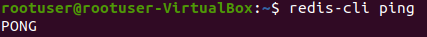

Устанавливаем Nginx

Устанавливаем необходимые пакеты для работы NetBox, а именно
python3 python3-pip python3-venv python3-dev build-essential libxml2-dev libxslt1-dev libffi-dev libpq-dev libssl-dev zlib1g-dev

Создаем папку для NetBox, клонируем в нее оффициальный репозиторий и выдаем права СИСТЕМНОМУ пользователю netbox на все папки 

```bash
sudo chown --recursive netbox /opt/netbox/netbox/media/
sudo chown --recursive netbox /opt/netbox/netbox/reports/
sudo chown --recursive netbox /opt/netbox/netbox/scripts/
sudo chown --recursive netbox /opt/netbox/venv/
```

Генерируем секретный ключ выполнив 
```bash
python3 ../generate_secret_key.py
```
и заполняем необходимые данные в configure.py, а именно - название базы данных имя пользователя базы данных и его пароль созданные в первом шаге, а так же секретный ключ, сгененрированный выше

Далее выполняем скрипт upgrade.sh и, после его выполнения, создаем суперпользователя непосредственно для нетбокс

```bash
source /opt/netbox/venv/bin/activate
cd /opt/netbox/netbox
python3 manage.py createsuperuser
```

Настроим nginx для работы NetBox, для этого:
копируем конфигурационный файл gunicorn и все необходимые файлы нетбокс
```bash
sudo cp /opt/netbox/contrib/gunicorn.py /opt/netbox/gunicorn.py
sudo cp -v /opt/netbox/contrib/*.service /etc/systemd/system/
```

Копируем конфиг файл нгинкса предоставленный netbox
```bash
sudo cp /opt/netbox/contrib/nginx.conf /etc/nginx/sites-available/netbox
sudo rm /etc/nginx/sites-enabled/default
sudo ln -s /etc/nginx/sites-available/netbox /etc/nginx/sites-enabled/netbox
```
и меняем порт дефолтного сервера нгинкс на любой другой из доступных.

Генерируем ssl ключи командой
```bash
sudo openssl req -new -x509 -nodes -days 365 -newkey rsa:2048 -keyout /etc/ssl/private/netbox.key -out /etc/ssl/certs/netbox.crt
```

Рестартаем nginx. Теперь мы можем перейти по 80 порту и айпи машины на веб-интерфейс NetBox

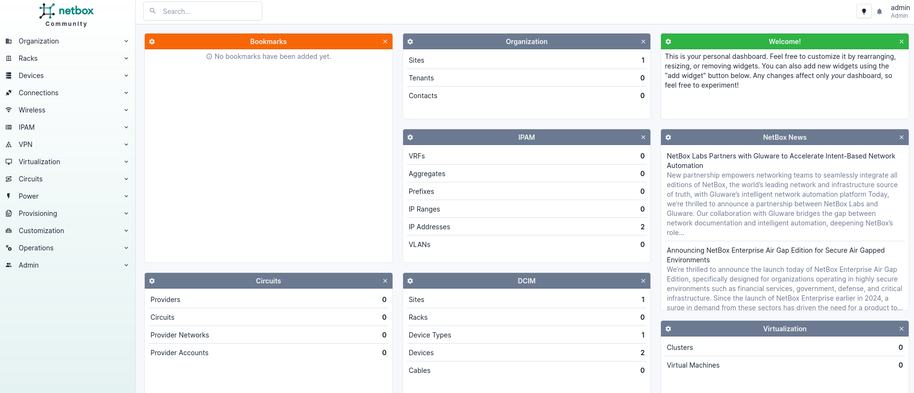


2. Настройка устройств в Netbox

Добавляем устройства CHR, предварительно добавив site, производителя, тип устройства и их роль

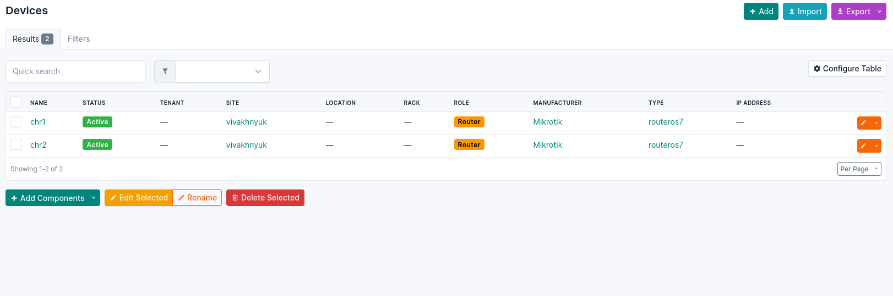

Далее создаем интерфейсы устройств

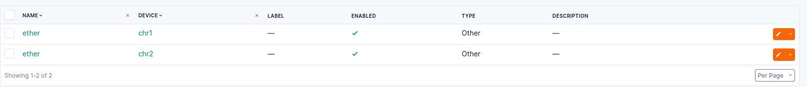

И назначаем им ip адреса

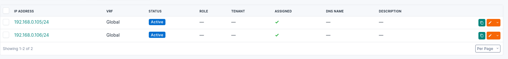

3. Создание inventory файла из данных NetBox

Создаем API токен в админ панели NetBox

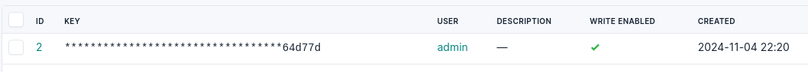

Создаем первый inventory файл, используюший модуль netbox.netbox.nb_inventory

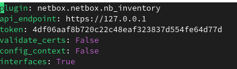

и выполняем команду

```bash
ansible-inventory -v --list -y -i --output_file pl2.yml netbox_inventory.yml
```

в результирующий файл добавляем поля необходимые для работы с chr, а именно

```yaml
all:
  vars:
    ansible_user: admin
    ansible_password: '123'
    ansible_connection: network_cli
    ansible_network_os: routeros
```

а так же поле ansible_host для каждого hosts с их айпи-адресами


4. Создание Playbook

Сначала создадим плейбук, меняющий имя машины на имя из netbox и добавляющий ей интрфейс с айпи-адресом

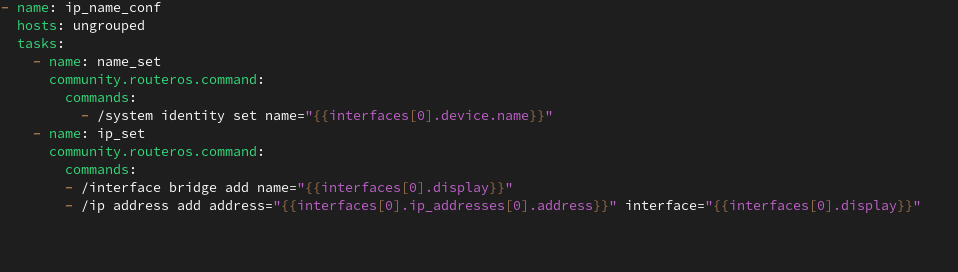

Выполним его 

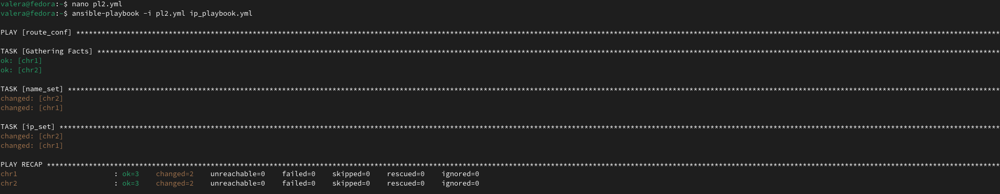

Проверяем изменения

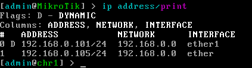

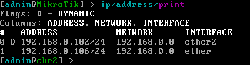

Теперь создадим плейбук, получающий серийный номер CHR и обновляющий его в NetBox

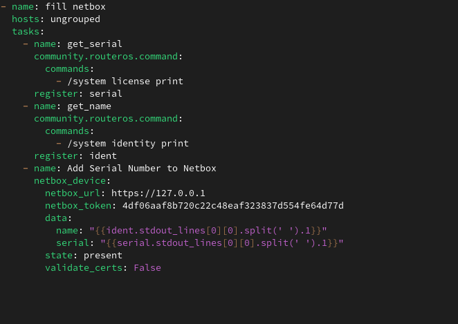

Выполняем его

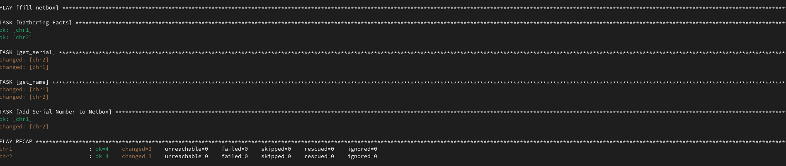

Проверяем изменения

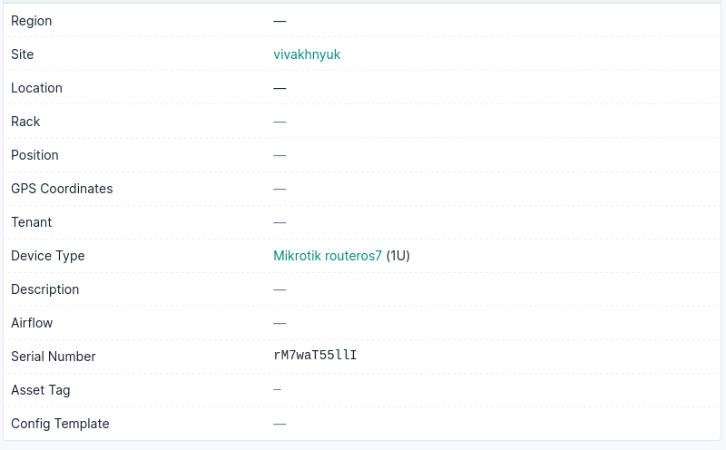

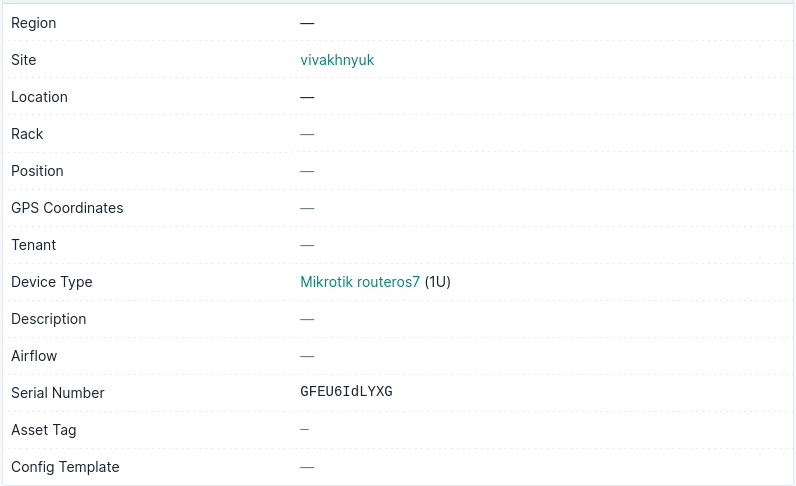

### Вывод: в ходе выполнения работы были получены навыки установки и настройки девайсов в NetBox, с помощью Ansible были изменены данные двух CHR, а так же получены и внесены данные о CHR в NetBox