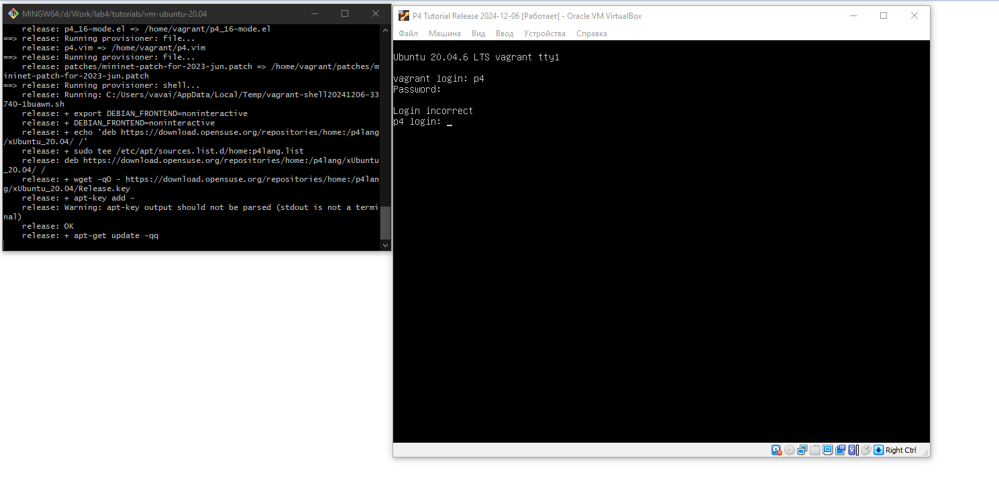
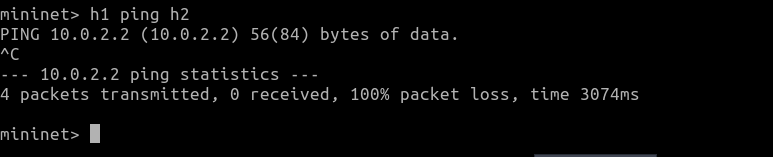
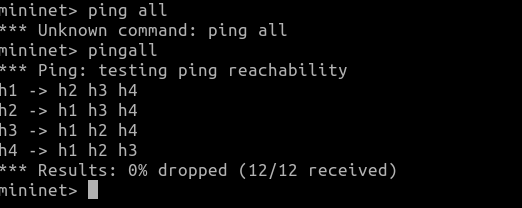
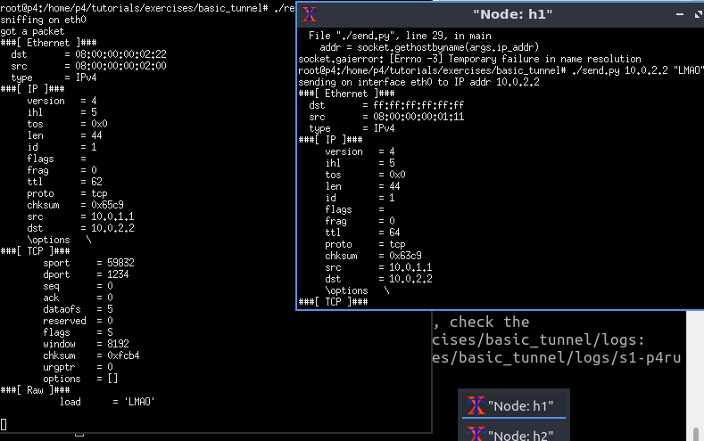
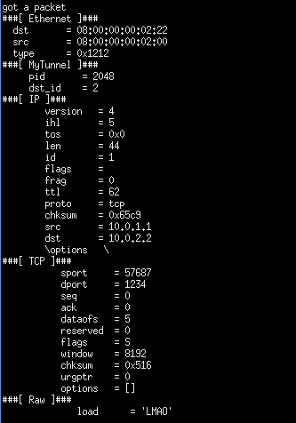
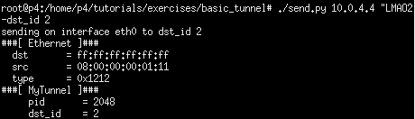
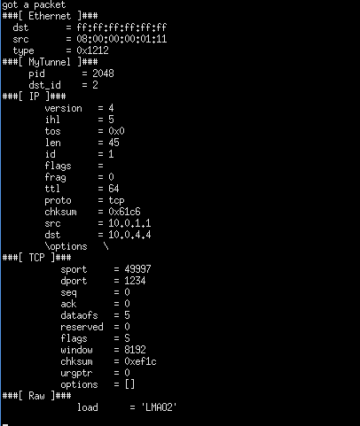

## Отчет по лабораторной работе №4 "Базовая 'коммутация' и туннелирование используя язык программирования P4"

University: [ITMO University](https://itmo.ru/ru/)

Faculty: [FICT](https://fict.itmo.ru)

Course: [Network programming](https://github.com/itmo-ict-faculty/network-programming)

Year: 2024/2025

Group: K34212

Author: Ivakhnyuk Valeriy Sergeevich

Lab: Lab4

Date of create: 01.12.2024

Date of finished: 09.12.2024

### Цель работы
Изучить синтаксис языка программирования P4 и выполнить 2 обучающих задания от Open network foundation для ознакомления на практике с P4.

### Ход работы. 1 задание.

Клонируем репозиторий p4/tutorials, и выполняем vagrant up dev из папки vm/ubuntu-20.04



Переходим в папку exercises/basic и выполняем команду make run, чтобы убедиться что все необходимые зависимости встали, после чего пробуем пингануть любой из свитчей



Выполним задание для восстановления работы сети

Дополним файл basic.p4, добавив реализации в функции, указанные в задании, а именно:

MyParser, разбирающая ethernet пакет, и распаковывающуя его в случае если это Ipv4 пакет;

```c
control MyIngress(inout headers hdr,
                  inout metadata meta,
                  inout standard_metadata_t standard_metadata) {
    action drop() {
        mark_to_drop(standard_metadata);
    }

    action ipv4_forward(macAddr_t dstAddr, egressSpec_t port) {
        standard_metadata.egress_spec = port;
        hdr.ethernet.srcAddr = hdr.ethernet.dstAddr;
        hdr.ethernet.dstAddr = dstAddr;
        hdr.ipv4.ttl = hdr.ipv4.ttl - 1;
    }

    table ipv4_lpm {
        key = {
            hdr.ipv4.dstAddr: lpm;
        }
        actions = {
            ipv4_forward;
            drop;
            NoAction;
        }
        size = 1024;
        default_action = NoAction();
    }

    apply {
        if(hdr.ipv4.isValid()){
        ipv4_lpm.apply();
        }
 }
}
```

MyIngress, обрабатывающая пакеты на входе. Добавим адрес получателя и уменьшим ttl на 1.

```c
control MyIngress(inout headers hdr,
                  inout metadata meta,
                  inout standard_metadata_t standard_metadata) {
    action drop() {
        mark_to_drop(standard_metadata);
    }

    action ipv4_forward(macAddr_t dstAddr, egressSpec_t port) {
        standard_metadata.egress_spec = port;
        hdr.ethernet.srcAddr = hdr.ethernet.dstAddr;
        hdr.ethernet.dstAddr = dstAddr;
        hdr.ipv4.ttl = hdr.ipv4.ttl - 1;
    }

    table ipv4_lpm {
        key = {
            hdr.ipv4.dstAddr: lpm;
        }
        actions = {
            ipv4_forward;
            drop;
            NoAction;
        }
        size = 1024;
        default_action = NoAction();
    }

    apply {
        if(hdr.ipv4.isValid()){
        ipv4_lpm.apply();
        }
 }
}
```

А так же функция MyDeparser, определяющая порядок полей при сборке пакета обратно.

```c
control MyDeparser(packet_out packet, in headers hdr) {
    apply {
       packet.emit(hdr.ethernet);
        packet.emit(hdr.ipv4);
    }
}
```


Запускаем с помощью make run и проверяем связь.



### Ход работы. 2 задание.

Во втором задании необходимо имплементировать базовое туннелирование, определив новый тип заголовка и изменив код коммутатора так, чтобы он принимал решение о порте назначения с использованием нового заголовка myTunnel.

Дополняем MyParser распаковкой MyTunnel

```c
parser MyParser(packet_in packet,
                out headers hdr,
                inout metadata meta,
                inout standard_metadata_t standard_metadata) {


    state start {
        packet.extract(hdr.ethernet);
        transition select(hdr.ethernet.etherType) {
            TYPE_IPV4 : parse_ipv4;
            TYPE_MYTUNNEL: parse_mytun;
            default : accept;
        }
    }

    state parse_ipv4 {
        packet.extract(hdr.ipv4);
        transition accept;
    }

    state parse_mytun {
        packet.extract(hdr.myTunnel);
        transition select(hdr.myTunnel.proto_id) {
                TYPE_IPV4: parse_ipv4;
                }
        }
}
```

Дополняем MyIngress действием myTunnel_forward по аналогии с ipv4_forward, таблицей с тунельной переадресацией по аналогии с ipv4_lpm и проверкой валидности заголовка myTunnel

```c
control MyIngress(inout headers hdr,
                  inout metadata meta,
                  inout standard_metadata_t standard_metadata) {
    action drop() {
        mark_to_drop(standard_metadata);
    }

    action ipv4_forward(macAddr_t dstAddr, egressSpec_t port) {
        standard_metadata.egress_spec = port;
        hdr.ethernet.srcAddr = hdr.ethernet.dstAddr;
        hdr.ethernet.dstAddr = dstAddr;
        hdr.ipv4.ttl = hdr.ipv4.ttl - 1;
    }

    table ipv4_lpm {
        key = {
            hdr.ipv4.dstAddr: lpm;
        }
        actions = {
            ipv4_forward;
            drop;
            NoAction;
        }
        size = 1024;
        default_action = drop();
    }

    // TODO: declare a new action: myTunnel_forward(egressSpec_t port)
        action myTunnel_forward(egressSpec_t port){
                standard_metadata.egress_spec = port;
        }

    // TODO: declare a new table: myTunnel_exact
    // TODO: also remember to add table entries!
        table myTunnel_exact {
                key = {
                        hdr.myTunnel.dst_id : exact;
                }
                actions = {
                        myTunnel_forward;
                        drop;
                }
                size = 1024;
                default_action = drop();
        }

    apply {
        // TODO: Update control flow
        if (hdr.ipv4.isValid()) {
            ipv4_lpm.apply();
        }
        if (hdr.myTunnel.isValid())
        {myTunnel_exact.apply();}
    }
}
```

И в функцию MyDeparser добавляем заголовок myTunnel

```c
control MyDeparser(packet_out packet, in headers hdr) {
    apply {
        packet.emit(hdr.ethernet);
        // TODO: emit myTunnel header as well
        packet.emit(hdr.myTunnel);
        packet.emit(hdr.ipv4);
    }
}
```

Компилируем и проверяем

Запускаем на h2 ./recieve.py

Для начала отправим простой пакет от h1 к h2 с помощью ./send.py 



После этого отправляем пакет, добавив к команде -dst_id = 2



Как видно на скриншоте выше, в пакет добавился заголовок MyTunnel, что значит туннелирование успешно отработало

Теперь отправим пакет по ip-адресу четвертого коммутатора, оставив dst_id равное двум 


В результате пакет все равно пришел на h2, что видно из вывода recieve.py



Следовательно, все работает как требуется по заданию

### Вывод

В результате выполнения работы был изучен синтаксис языка программирования P4 и выполнены 2 обучающих задания от Open network foundation для ознакомления на практике с P4.